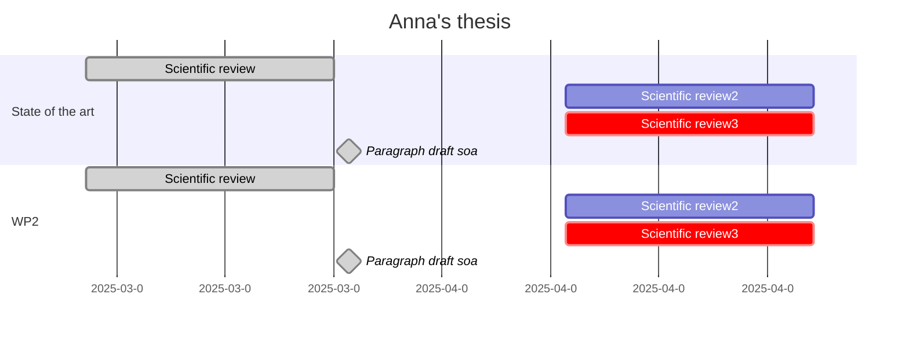

# hospital-stay-discharge-prediction

Hospital length of stay (LOS) and discharge type are key metrics in healthcare, influencing patient outcomes and resource allocation. This project aims to establish a foundation for predictive modeling of LOS and discharge type by analyzing clinical and laboratory data, including patient demographics, diagnoses, and outcomes.

