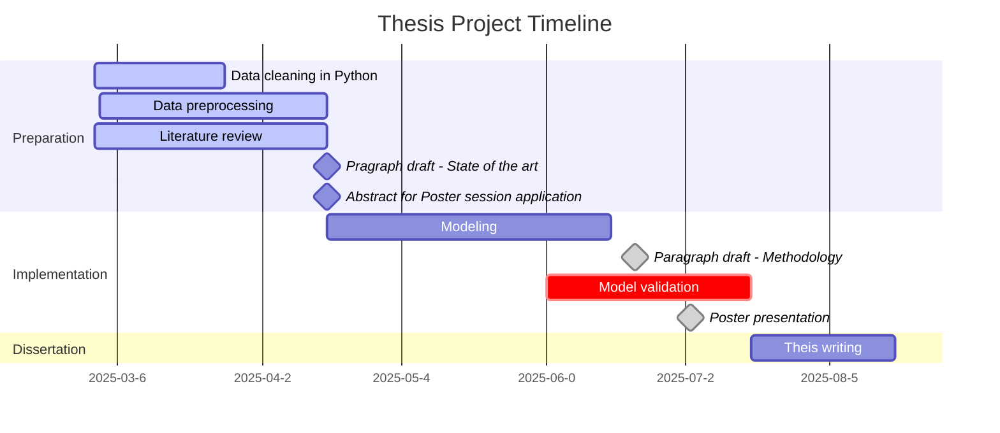

# Predicting hospital length of stay and discharge type using admission lab results, demographics, and diagnosis

Hospital length of stay (LOS) and discharge type are critical factors in patient care and healthcare resource management. This project aims to develop predictive models for LOS and discharge type using clinical and laboratory data, incorporating patient demographics, initial lab values, and principal diagnoses. Accurate predictions could enhance patient care, optimize resource allocation, and facilitate timely coordination of social and medical services.




## Project structure
```
project-root/
│
├── src/                   # Source code
│   ├── main.py            # Entry point for data pipeline & modeling
│   ├── utils.py           # Utilities for preprocessing, modeling, logging
│   ├── README.md          # Detailed run instructions
│
├── data/                  # Raw and processed data (not tracked)
│
├── config/                # Configuration files (YAML)
│
├── bash_scripts/          # SLURM job scripts (HPC)
│
├── results/               # Model results and logs
│
├── models/                # Saved models (joblib)
│
├── environment.yaml       # Conda environment specification
├── README.md              # This file
```
## How to Run the Pipeline

1. Set up the environment

```bash
conda env create -f environment.yaml
conda activate los_prediction
```
2. Clean and preprocess data

```bash
python src/main.py --step clean_only
```

3. Train baseline models

```bash
python src/main.py --step baseline_los --dataset nan_icd_blocks_only --target los --mode binary --thresholds 7
```

4. Run model comparison

```bash
python src/main.py --step run_model --dataset nan_new_features --target discharge_type
```

For full CLI documentation, see src/README.md

## Features

### Implemented
- Classification (binary, multiclass) and regression support
- Configurable preprocessing pipeline (imputation, encoding, scaling)
- Model comparison across dataset variants

### In Progress
- LOS threshold optimization and two-step modeling
- SMOTE for class imbalance
- SHAP-based model explainability


## Supervisor & Contributors

Supervisor: Prof. Alexander Benedikt Leichtle

MSc Student: Anna Scarpellini Pancrazi


## Running the main pipeline

See [`src/README.md`](src/README.md) for detailed instructions on how to run `main.py`.