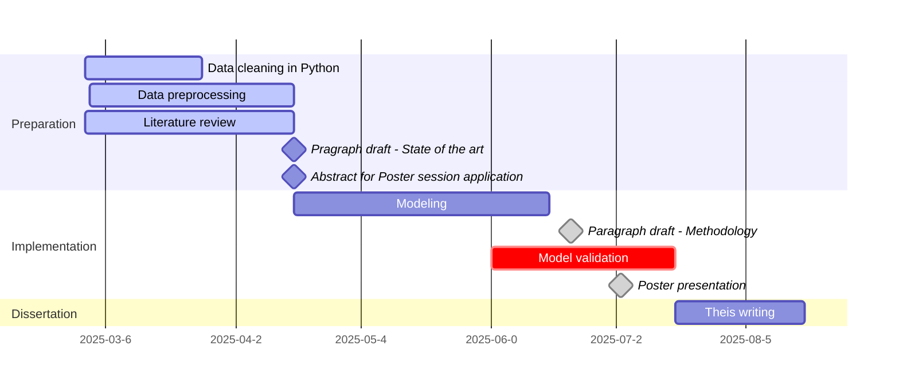

# Predicting hospital length of stay and discharge type using admission lab results, demographics, and diagnosis

Predicting hospital length of stay (LoS) and discharge type using admission clinical data and laboratory results. Accurate predictions could enhance patient care, optimize resource allocation, and facilitate timely coordination of social and medical services.

### Project Timeline:

### Ongoing Work:

- **Cleaning and preprocessing clinical and lab data** for predictive modeling of hospital length of stay and discharge type.
- **Investigating methods for handling missing data and outliers** in the dataset -> MissForest imputation algorithm and Isolation Forest for outlier detection.
- **Studying model selection, feature engineering, and variable selection techniques** for predicting hospital length of stay (LOS).
- **Reviewing literature** to understand related methods and approaches in predicting LOS and discharge type.

### Supervisor & Contributors

Supervisor: Prof. Alexander Benedikt Leichtle

MSc Student: Anna Scarpellini Pancrazi
