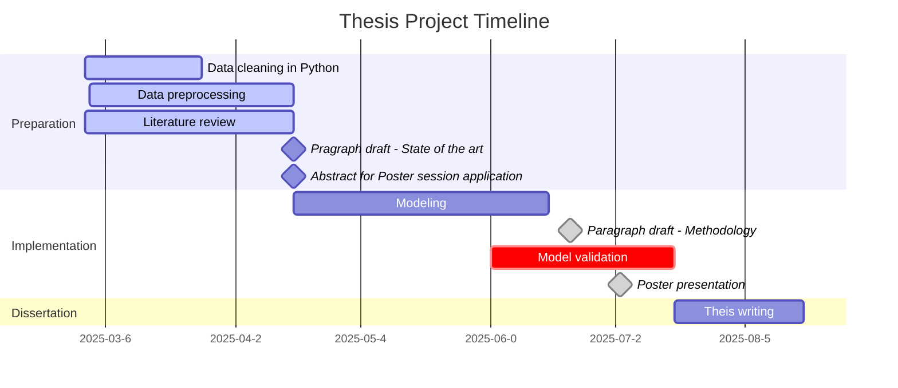

# hospital-stay-discharge-prediction

Hospital length of stay (LOS) and discharge type are key metrics in healthcare, influencing patient outcomes and resource allocation. This project aims to build predictive models for LOS and discharge type by analyzing clinical and laboratory data, including patient demographics, diagnoses, and outcomes.

